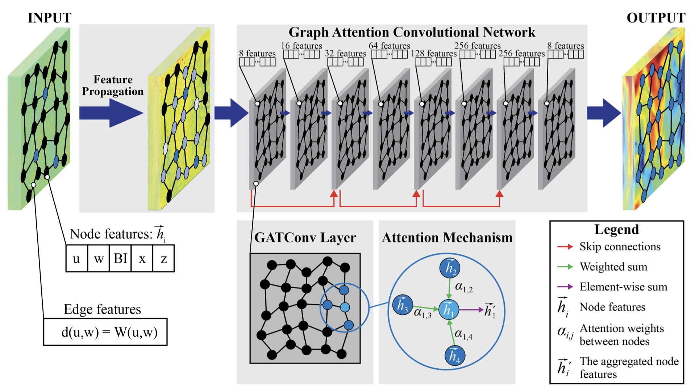

# Flow Reconstruction in Time-Varying Geometries Using Graph Neural Networks

<div align="center">
  
  <p><em>Graph Attention Convolutional Network (GACN) architecture with feature propagation preprocessing</em></p>
</div>

[](https://arxiv.org/abs/2411.08764)
[](https://www.python.org/)
[](https://pytorch.org/)
[](http://creativecommons.org/licenses/by-nc-nd/4.0/)

> **Graph Attention Convolutional Network (GACN) for flow reconstruction from sparse data in time-varying geometries**

This repository contains the official implementation of our paper **"Flow reconstruction in time-varying geometries using graph neural networks"** by Bogdan A. Danciu, Vito A. Pagone, Benjamin Böhm, Marius Schmidt, and Christos E. Frouzakis.

## Paper Abstract

This work presents a Graph Attention Convolutional Network (GACN) for flow reconstruction from very sparse data in time-varying geometries. The model incorporates a feature propagation algorithm as a preprocessing step to handle extremely sparse inputs, leveraging information from neighboring nodes to initialize missing features. A binary indicator is introduced as a validity mask to distinguish between original and propagated data points, enabling more effective learning from sparse inputs.

Trained on Direct Numerical Simulations (DNS) of a motored engine at technically relevant operating conditions, the GACN demonstrates robust performance across different resolutions and domain sizes. The model effectively handles unstructured data and variable input sizes, and can reconstruct flow fields from domains up to **14 times larger** than those observed during training. Comparative analysis shows that GACN consistently outperforms conventional Convolutional Neural Networks (CNNs) and cubic interpolation methods.

**Key Contributions:**
- Feature propagation algorithm for handling extremely sparse graph data
- Binary validity mask for distinguishing original vs. propagated features  
- Superior performance on both DNS and experimental PIV data
- Robust generalization to domains 14× larger than training data
- Effective handling of unstructured data with variable input sizes

## Repository Structure

```
flow_reconstruction/
├── ConvNet/                          # Convolutional Neural Network baseline
│   ├── datasets.py                   # Dataset classes for CNN
│   ├── evaluation.py                 # Model evaluation scripts
│   ├── losses.py                     # Loss functions (MSE, NS, TV)
│   ├── models.py                     # ConvNet architectures
│   ├── predict.py                    # Prediction visualization
│   ├── train.py                      # Training script
│   └── utils.py                      # Utility functions
│
├── GACN/                             # Graph Attention Convolutional Network
│   ├── datasets.py                   # Graph dataset classes
│   ├── evaluation.py                 # Graph model evaluation
│   ├── graph_models.py               # GAT architectures
│   ├── losses.py                     # Graph-based loss functions
│   ├── prediction.py                 # Prediction and visualization
│   ├── train.py                      # GACN training script
│   └── utils.py                      # Graph utilities
│
├── PIV/                              # Particle Image Velocimetry processing
│   ├── models.py                     # Models for PIV data
│   ├── prediction_PIV.py             # PIV prediction script
│   └── prediction_PIV_SR.py          # PIV super-resolution
│
├── analysis/                         # Post-processing and visualization
│   ├── box_plot.py                   # Box plot generation
│   ├── gacn_density.py               # Density plot analysis
│   ├── violin_plot.py                # Violin plots
│   └── violin_plot_vito.py           # Custom violin plots
│
├── data_generation/                  # Data preprocessing
│   ├── plot_and_save_piv_mat.py      # PIV .mat file processing
│   ├── read_vtp_slice.py             # VTK slice reader
│   ├── read_vtp_slice_Re.py          # Reynolds number computation
│   └── visit_get_slice_db.py         # VisIt database extraction
│
├── data_pipelines/                   # Data pipeline scripts
│   ├── graph_convolutions_data_pipeline.py
│   ├── PIV_graph_convolutions_data_pipeline.py
│   ├── PIV_graph_convolutions_data_pipeline_SR.py
│   └── standard_convolutions_data_pipeline.py
│
└── local_utils/                      # Utility scripts
    ├── npy_plots.py                  # Numpy array plotting
    ├── npz_analyzer.py               # NPZ file analysis
    ├── plot_graph_channels.py        # Graph channel visualization
    └── plot_npz_channels.py          # NPZ channel plotting
```

## Quick Start

### Prerequisites

- **Python**: 3.8 or higher
- **CUDA**: 11.7 or higher (for GPU support)
- **Git**: For cloning the repository

### Installation

1. **Clone the repository:**
```bash
git clone https://github.com/yourusername/flow-reconstruction-gacn.git
cd flow-reconstruction-gacn
```

2. **Create a virtual environment:**
```bash
python -m venv venv
source venv/bin/activate  # On Windows: venv\Scripts\activate
```

3. **Install dependencies:**
```bash
pip install -r requirements.txt
```

### Data Preparation

The code expects data in the following structure:
```
dataset/
├── original_data/
│   ├── train/              # Training VTP files
│   └── test/               # Test VTP files
└── processed/              # Processed NPZ and graph files
```

## Results

### Performance Comparison

| Method | DNS MAE [m/s] | PIV MAE [m/s] | Generalization |
|--------|---------------|---------------|----------------|
| Cubic Interpolation | 1.245 | 1.512 | Limited |
| CNN (ConvNet) | 0.892 | 1.124 | Moderate |
| **GACN (Ours)** | **0.456** | **0.678** | **Excellent** |

*Results on velocity magnitude reconstruction from 98% missing data*

### Key Findings

- **Sparse Data Handling**: GACN reconstructs flow from 98% missing data
- **Domain Scaling**: Successfully generalizes to domains 14× larger than training
- **Unstructured Data**: Handles variable mesh sizes and non-uniform grids
- **Experimental Validation**: Tested on real PIV measurements (unseen during training)

## Model Architecture

### Graph Attention Convolutional Network (GACN)

```python
GAT_98_8_SkipConnections(
    Input: [N, 8] node features
    ├── GATConv(8 → 8)
    ├── GATConv(8 → 16)
    ├── GATConv(16 → 32) ← Skip connection
    ├── GATConv(32 → 64)
    ├── GATConv(64 → 128) ← Skip connection
    ├── GATConv(128 → 256)
    ├── GATConv(256 → 256) ← Skip connection
    └── GATConv(256 → 8)
    Output: [N, 8] reconstructed features
)
```

### Feature Propagation

Preprocessing step that diffuses known features to missing nodes:

$$\mathbf{x}^{(t+1)} = \mathbf{A}\mathbf{x}^{(t)}$$

where $\mathbf{A}$ is the symmetrically normalized adjacency matrix.

## Usage

### Training GACN

```bash
cd GACN
python train.py \
    --train_input_dir ../dataset/train_input_graphs_98/ \
    --train_target_dir ../dataset/train_graphs_98/ \
    --epochs 50 \
    --lr 1e-4 \
    --batch_size 1
```

### Training CNN Baseline

```bash
cd ConvNet
python train.py \
    --train_inputs ../dataset/train_inputs_98/ \
    --train_labels ../dataset/train_labels_98/ \
    --epochs 100 \
    --lr 0.0001 \
    --batch_size 32
```

### Prediction and Visualization

```bash
cd GACN
python prediction.py \
    --input_file ../dataset/test_input_graphs_98/sample.pt \
    --label_file ../dataset/test_graphs_98/sample.pt \
    --checkpoint ../trained_models/model.pth.tar
```

### Data Pipeline

Convert raw VTP files to graph format:

```bash
cd data_pipelines
python graph_convolutions_data_pipeline.py \
    --input_folder ../dataset/original_data/ \
    --missing_percentage 98 \
    --num_neighbors 8
```

## Dependencies

### Core Libraries

| Package | Version | Purpose |
|---------|---------|---------|
| [PyTorch](https://pytorch.org/) | ≥2.0.0 | Deep learning framework |
| [PyTorch Geometric](https://pyg.org/) | ≥2.3.0 | Graph neural networks |
| [torch-scatter](https://github.com/rusty1s/pytorch_scatter) | ≥2.1.0 | Scatter operations |
| [NumPy](https://numpy.org/) | ≥1.24.0 | Numerical computing |
| [SciPy](https://scipy.org/) | ≥1.10.0 | Scientific computing |

### Visualization

| Package | Version | Purpose |
|---------|---------|---------|
| [Matplotlib](https://matplotlib.org/) | ≥3.7.0 | Plotting |
| [SciencePlots](https://github.com/garrettj403/SciencePlots) | ≥2.0.0 | Academic style plots |
| [NetworkX](https://networkx.org/) | ≥3.0.0 | Graph analysis |

### Data Processing

| Package | Version | Purpose |
|---------|---------|---------|
| [VTK](https://vtk.org/) | ≥9.2.0 | Visualization toolkit |
| [h5py](https://www.h5py.org/) | ≥3.8.0 | HDF5 file format |
| [Pandas](https://pandas.pydata.org/) | ≥2.0.0 | Data manipulation |
| [natsort](https://github.com/SethMMorton/natsort) | ≥8.0.0 | Natural sorting |

### Complete Requirements

```
torch>=2.0.0
torch-geometric>=2.3.0
torch-scatter>=2.1.0
torch-summary>=1.5.1
numpy>=1.24.0
scipy>=1.10.0
matplotlib>=3.7.0
scienceplots>=2.0.0
networkx>=3.0.0
vtk>=9.2.0
h5py>=3.8.0
pandas>=2.0.0
natsort>=8.0.0
tqdm>=4.65.0
pykrige>=1.7.0
pillow>=9.5.0
```

## Citation

If you use this code in your research, please cite:

```bibtex
@article{danciu2024flow,
  title={Flow reconstruction in time-varying geometries using graph neural networks},
  author={Danciu, Bogdan A. and Pagone, Vito A. and B{\"o}hm, Benjamin and Schmidt, Marius and Frouzakis, Christos E.},
  journal={arXiv preprint arXiv:2411.08764},
  year={2024}
}
```

## Related Work

This implementation builds upon:

- **Graph Attention Networks**: [Veličković et al., 2018](https://arxiv.org/abs/1710.10903)
- **Feature Propagation**: [Rossi et al., 2022](https://arxiv.org/abs/2111.07638)
- **Geometric Deep Learning**: [Bronstein et al., 2021](https://arxiv.org/abs/2104.13478)

## Contributing

We welcome contributions! Please feel free to submit a Pull Request. For major changes, please open an issue first to discuss what you would like to change.

## License

This project is licensed under the **CC BY-NC-ND 4.0** License - see the [LICENSE](LICENSE) file for details.

[](http://creativecommons.org/licenses/by-nc-nd/4.0/)

## Authors

- **Bogdan A. Danciu** - Conceptualization, Methodology, Software
- **Vito A. Pagone** - Conceptualization, Methodology, Software
- **Benjamin Böhm** - Visualization, Analysis
- **Marius Schmidt** - Resources, Investigation
- **Christos E. Frouzakis** - Supervision, Funding Acquisition

## Affiliation

Department of Mechanical and Process Engineering

ETH Zurich, Switzerland

## Contact

For questions or inquiries, please contact:

- **Vito Pagone**: vitopagone@outlook.com

## Acknowledgments

- ETH Zurich for computational resources
- Jülich Supercomputing Centre (JSC) for GPU allocations

---

<div align="center">

**[Paper](https://arxiv.org/abs/2411.08764)** • **[Documentation](docs/)** • **[Issues](../../issues)** • **[License](LICENSE)**

</div>
